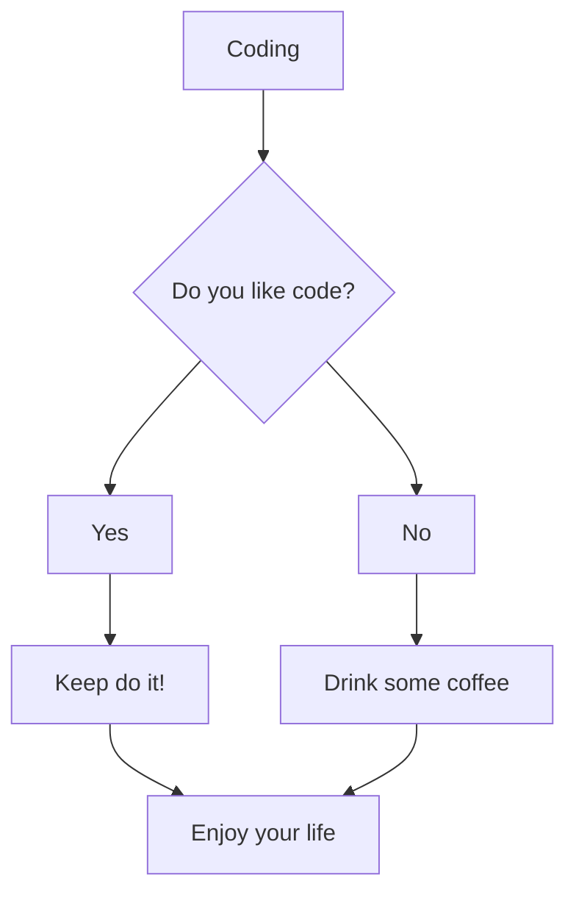

```python
class Programmer:
    def __init__(self):
        self.name = 'Artem'
        self.company = 'Wargaming'
        self.skills = ['Python', 'Golang', 'JavaScript']
        self.databases = ['Redis', 'PostgreSQL', 'MongoDB']
        self.misc = ['Docker']
        self.working_on = ['ISTQB Certificate', 'Teaching skills']
        self.telegram = "@neverdieone"
        self.email = "altiore@mail.ru"
```



